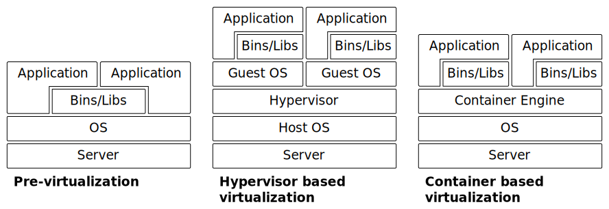

# Deployment

## Strategies

References:
- [Deployment Strategies and Release Best Practices](http://cgrant.io/article/deployment-strategies/)

### Decentral

### Central

#### Highlander Deployment

"There can be only one"

Process:
- The changes are deployed to all servers at the same time

#### Rolling Deployment

Precondition:
- All Potentially Shippable Increment are downward compatible

Process:
- The changes are deployed to the servers one after another

#### Blue/Green Deployment

Preconditions:
- Two systems with the same infratructure exist
- One system is serving requests (connected) the other is not available to the public (disconnected)

Process:
- The changes are deployed to the servers in the disconnected system
- Acceptance tests are performed in the disconnected system
- The disconnected system is connected while the other is disconnected

#### Canary Deployment

Preconditions:
- Sessions are sticky
- A subset of the servers have been selected to act as canary server(s)

Process:
- The changes are deployed to the cabary server(s)
- The changes are evalaluated by the users that are redirected to the canary servers
- In case there are no major issues, the deployment can be extended to the remainng servers

#### Deploymnet Rings

Also known as Blast Radius.

Rings:
- Canaries
- Early Adopters
- Users

Resources:
- [Explore how to progressively expose your Azure DevOps extension releases in production to validate, before impacting all users](https://docs.microsoft.com/en-us/azure/devops/articles/phase-rollout-with-rings)

#### Multi-Cloud

- [Spinnaker](https://www.spinnaker.io/)

## Technologies

### Virtualization

#### Hypervisor based Virtualization

Products:
- VMWare
- VirtualBox
- Hyper-V
- ...

#### Container based Virtualization

Container Runtimes:
- Docker
  - Remarks:
    - De-facto standard
- Windows Containers
- ...

Container Orchestration:
- Kubernetes
  - Remarks
    - De-facto standard
    - Sometimes abreviated "K8s"
  - Features:
    - Deployment-History (documentation, rollbacks, ...)
    - Labeling (place restrictions on deployments that aim to meet
      specific requirements e.g. server capabilities like HW support)
    - Health monitoring (liveness- & readiness-probing)
    - CLI: `kubectl`
    - GUI: Dashboard UI
- Docker Swarm
- Apache Mesos + Marathon
- Amazon ECS
- ...

Resources:
- General:
  - [Cloud Native Computing Foundation](https://www.cncf.io/)
- Docker:
  - [How Should I Get Application Configuration into my Docker Containers?](https://dantehranian.wordpress.com/2015/03/25/how-should-i-get-application-configuration-into-my-docker-containers/)
- Kubernetes:
  - [Kubernetes Tutorial | Kubernetes | Kubernetes tutorial for beginners](https://www.youtube.com/watch?v=gpmerrSpbHg)
  - [Container Management: Kubernetes vs Docker Swarm, Mesos + Marathon, Amazon ECS](https://platform9.com/wp-content/uploads/2018/08/kubernetes-comparison-ebook.pdf)
  - [kubectl Commands](https://kubernetes.io/docs/reference/generated/kubectl/kubectl-commands)
  - [kubectl Cheat Sheet](https://kubernetes.io/docs/reference/kubectl/cheatsheet/)
  - [Deploy Kubernetes Web UI (Dashboard) on Docker for Windows](https://www.ntweekly.com/2018/05/25/deploy-kubernetes-web-ui-dashboard-docker-windows/) along with [Create An Authentication Token (RBAC)](https://github.com/kubernetes/dashboard#create-an-authentication-token-rbac)
  - Troubleshooting:
    - [Kubernetes fails to start (hangs in starting phase) #1962](https://github.com/docker/for-win/issues/1962#issuecomment-418152414)
    - [Trouble installing applications in Kubernetes #1651](https://github.com/docker/for-win/issues/1651#issuecomment-364168129)