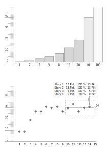

# Scrum

## Terminology

### Potentially Shipable Increment (PSI)

Resouces:
- https://agilevelocity.com/product-owner/psi-potentially-shippable-increment/

### Minimum Viable Product (MVP)

- Is a fully functioning product release that is developed with the least effort possible
- MVPs are used to explore a hypothesis about what your customers really want
- They are much closer to prototypes than they are to the “real” running version of your end product

Resouces:
- https://agilevelocity.com/product-owner/mvp-mmf-psi-wtf-part-one-understanding-the-mvp/
- https://blog.checkmate.digital/poc-vs-prototype-vs-mvp-b202f2f70506
- https://scrumandkanban.co.uk/what-is-an-mvp/
- https://www.disciplinedagiledelivery.com/defining-mvp/

### Minimal Marketable Feature (MMF)

- The smallest piece of functionality that can be delivered that has value to both
  the organization delivering it and the people using it

Resouces:
- https://www.disciplinedagiledelivery.com/defining-mvp/

### Minimal Marketable Release (MMR)

- A collection of Minimal Marketable Features
- A mean of communication

Resouces:
- https://www.disciplinedagiledelivery.com/defining-mvp/

### Minimal Marketable Product (MMP)

- The first Minimal Marketable Release

### Story Points

Resouces:
- https://www.disciplinedagiledelivery.com/defining-mvp/