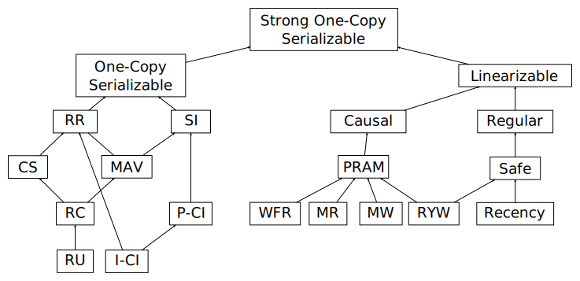

# Software Quality

## Definition of Done

- Should be kept lean and simple
  - Determine whether a test requires common sense; if not, strife to automate the test
  - The result of multiple automated tests should be compacted into binary indicators if possible
  - Include the condition to assure for each indicator that there is no detected issue in the DoD

## Test Automation

### Unit Tests

- Agree on criteria for the the derivation of unit test cases
- Agree on a common style for authoring unit tests
- Agree to check the criteria and the style during code review
- Agree on a moderate threshold for the code coverage of unti tests
- Agree on the tool that will provide the authoritative code coverage measurement
- Establish an alert
- Keep in mind that code coverage is only an indicator that there might be a qulity issue; it does not replace the use of common sense during review

Resources:
- [Unit Test Fetish](http://250bpm.com/blog:40)
- [Lean Testing or Why Unit Tests are Worse than You Think](https://blog.usejournal.com/lean-testing-or-why-unit-tests-are-worse-than-you-think-b6500139a009)

### Integration Tests

- Consider creating integration tests for accessing the infrastructure
- Consider creating integration tests for the most important workflows

### End-To-End Test

## Operations

### CAP Theorem

- The CAP theorem does prove that a spectrum exists that needs to be considered to choose a balanced mixture of the qualities
  of [partion tolerance](#partition_tolerance), [availability](#cap_availability) and [consistency](#consistency)
  for a given sub-system, since all qualities cannot be maximized
- Criticism:
  - Though accepted, the theorem is not considered a good tool for making decisions

Resources:
- [Siddhartha Reddy - CAP Theorem: You don’t need CP, you don’t want AP, and you can’t have CA](https://www.youtube.com/watch?v=hUd_9FENShA)
- [A Bias For Action - CAP Theorem](http://abiasforaction.net/cap-theorem/)
- [Please stop calling databases CP or AP](http://martin.kleppmann.com/2015/05/11/please-stop-calling-databases-cp-or-ap.html)

#### Partition Tolerance

> When a network is partitioned, all messages send from nodes in one component of the partition
> to nodes in the other component are lost"

- Network partitions are going to happen.
  - It might be a rare occasion, yet it is associated with a probability,
    high enough to pose significant risk to consider

#### CAP Availability

> Every request received by a non-failing node in the system must result in a response

- In contrast to the usual meaning of [availability](#availability), in the CAP theorem the term doesn't focus on the downtime of the system
  but on the general ability of a node, that hasn't failed, to answer

#### Consistency

source: [Highly Available Transactions: Virtues and Limitations](http://www.vldb.org/pvldb/vol7/p181-bailis.pdf), p. 188

##### Strong One-Copy Serializability (1SR)

##### Linearizable

- The initialization of an operation and the confirmation requires time
- Each read will see some current state between invocation and completion but not a state prior to the read
- No non-monotonic reads, thus the order of vlaues is preserved

##### Sequential

- It is possible to read older states
- No non-monotonic reads, thus the order of vlaues is preserved

##### Causal

- Only causally related operations must occur in order

##### Pipelined Random Access Memory (PRAM)

- The combination of
  - monotonic reads
  - monotonic writes
  - read your write

##### Writes Follow Reads (WFR)

- If a session observes an effect of transaction T1 and subsequently commits transaction T2,  then another session can only observe effects of T2 if it can also observe T1’s effects (or later values that supersede T1’s);

##### Read Your Writes (RYW)

- Whenever a client reads a given dataitem after updating it, the read returns the updated value (or a valuethat overwrote the previously written value)

##### Monotonic Reads (MR)

- Within a session, subsequent readsto a given object “never return any previous values”
- Reads fromeach item progress according to a total order

##### Monotonic Writes (MW)

- Each session’s writes become visi-ble in the order they were submitted. Any order on transactions (asin Read Uncommitted isolation) should also be consistent with anyprecedence that a global observer would see

##### One-Copy Serializability (1SR)

##### Repeatable Read (RR)

- No Fuzzy Read: if a transaction reads the samedata more than once, it sees the same value each time

##### Cursor Stability (CS)

##### Monotonic Atomic View (MAV)

- Once some of the effects of a transaction T1 are observed by another transaction T2, thereafter, all effects of T1 are observed by T2

##### Read Committed (RC)

- No dirty reads: transactions shouldnot access uncommitted or intermediate versions of data items

##### Read Uncommitted (RU)

##### Snapshot Isolation (SI)

##### Item Cut Isolation (I-CI)

##### Predicate Cut Isolation (P-CI)

##### Consistent Read

##### Recency

##### Safe

##### Regular

Resources
- [Strong consistency models](https://aphyr.com/posts/313-strong-consistency-models)
- [Highly Available Transactions: Virtues and Limitations](http://www.vldb.org/pvldb/vol7/p181-bailis.pdf)

### PACELC

- An alternative to the CAP theorem, which is considered better suited for a practical scenario
- The dimensions are
  - Availability-Consistency for a system that is not partitioned
  - Latency-Consistency for a system that is partitioned

### Availability

Availability|Max. downtime      |Remarks
-----------:|------------------:|-------
99 %        |87,6 hours/year    |
99,1 %      |78,84 hours/year   |
99,2 %      |70,08 hours/year   |
99,3 %      |61,32 hours/year   |
99,4 %      |52,56 hours/year   |
99,5 %      |43,8 hours/year    |
99,6 %      |35,04 hours/year   |
99,7 %      |26,28 hours/year   |
99,8 %      |17,52 hours/year   |
99,9 %      |8,76 hours/year    |
99,95 %     |4,38 hours/year    |
99,97 %     |2,628 hours/year   |
99,98 %     |1,752 hours/year   |
99,99 %     |52,56 minutes/year |HA
99,999 %    |5,256 minutes/year |HA
99,9999 %   |31,536 seconds/year|HA
100 %       |0 seconds/year     |HA

- Strategies
  - Redundancy
  - Workload Partitioning (e.g. Batch, Realtime)
  - Request Level Caching
  - Fallback strategy
    - Minimum required data stored at client (encrypted cookie/token)

Implications
- Needs be be taken into consideration when performing
  failure testing in a life system
